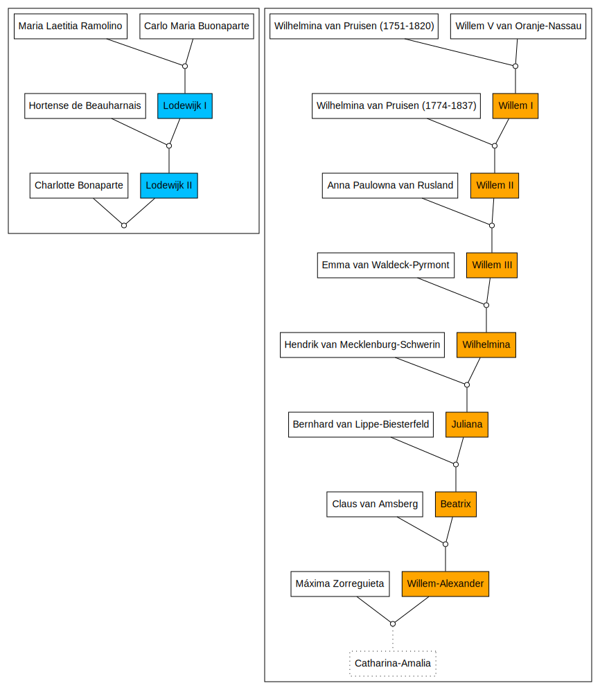

```{r setup, include=FALSE}
knitr::opts_chunk$set(collapse = TRUE)
```

# The question

How to present a list of Dutch monarchs and their parents as a diagram?


```{r}
library(magrittr)
library(DiagrammeR)
library(DiagrammeRsvg)

'Monarchie_in_Nederland.gv' %>%
  grViz() %>%
  export_svg() %>%
  writeLines('Monarchie_in_Nederland.svg')

```




# References

https://nl.wikipedia.org/wiki/Monarchie_in_Nederland