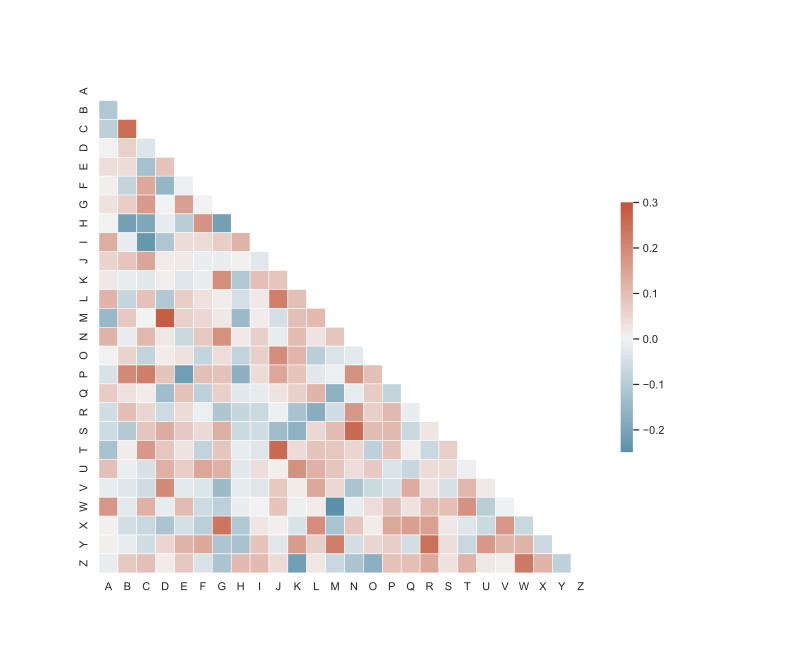

```{r, eval = FALSE}
Sys.setenv(RETICULATE_MINICONDA_PATH = 'C:/Users/Public/r-miniconda')
```

```{python, eval = FALSE}
import subprocess
import sys

def install(package):
    subprocess.check_call([sys.executable, "-m", "pip", "install", package])

install('seaborn')

```

```{python}
# library & dataset
#import seaborn as sns
#import matplotlib.pyplot as plt
#df = sns.load_dataset('iris')

# use the function regplot to make a scatterplot
#sns.regplot(x=df["sepal_length"], y=df["sepal_width"])
#plt.savefig('saving-a-seaborn-plot-as-pdf-file.svg')
```


```{python, eval = FALSE}
from string import ascii_letters
import numpy as np
import pandas as pd
import seaborn as sns
import matplotlib.pyplot as plt 

sns.set_theme(style="white")

# Generate a large random dataset
rs = np.random.RandomState(33)
d = pd.DataFrame(data=rs.normal(size=(100, 26)),
                 columns=list(ascii_letters[26:]))

# Compute the correlation matrix
corr = d.corr()

# Generate a mask for the upper triangle
mask = np.triu(np.ones_like(corr, dtype=bool))

# Set up the matplotlib figure
f, ax = plt.subplots(figsize=(11, 9))

# Generate a custom diverging colormap
cmap = sns.diverging_palette(230, 20, as_cmap=True)

# Draw the heatmap with the mask and correct aspect ratio
sns.heatmap(corr, mask=mask, cmap=cmap, vmax=.3, center=0,
            square=True, linewidths=.5, cbar_kws={"shrink": .5})
f.savefig('saving-a-seaborn-plot-as-pdf-file.svg')
```

